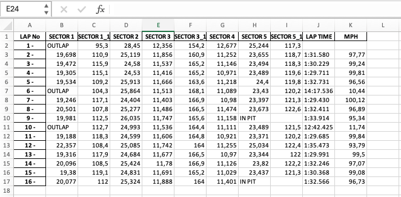
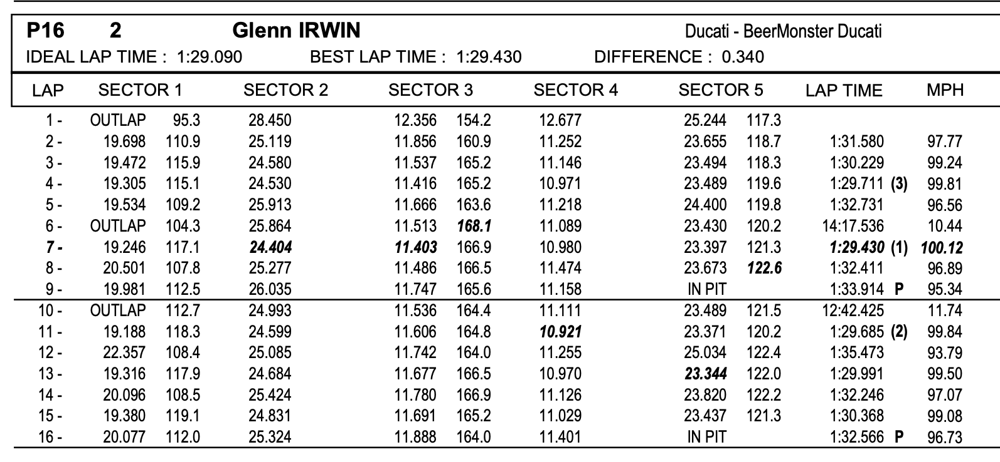

# Bennetts British Superbike Championship Scraper

## Project Description

This tool is designed to scrape timing and speed data from Timing PDF files of the Bennetts British Superbike Championship. Engineers and analysts can use this to extract rider-specific session data into a structured Excel (.xlsx) format for further analysis. It simplifies the process of data extraction, allowing for a focus on performance assessment and strategy development for race teams and enthusiasts.

## Features

- Extracts timing and speed data for individual riders from specified PDF documents.
- Organizes session data into separate sheets within a single Excel file for easy access and subsequent analysis.

## How to Use

1. Install required dependencies: `pip install -r requirements.txt`.
4. Run the script jupyter notebook file.
5. Enter the rider's name and the path to the PDF file you wish to scrape.
6. The script will process the data and output an Excel file with the results.

## Output

The Excel file will have the following structure:
- Each session for the rider will be nested within its own sheet.
- Sheets will contain columns for lap number, sectors, lap time, and speed.
- The Excel file will be saved in the same directory as the script or a specified output directory.

## Example

Below are example images showing the extracted data in the final Excel output and a sample from the PDF source file for a single session:

- Final Excel output:
 

- PDF Source file:
 
